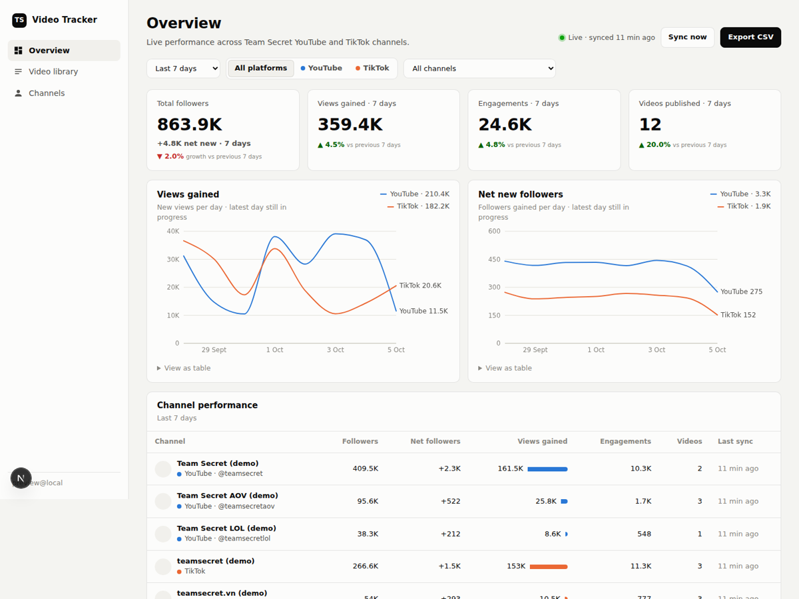
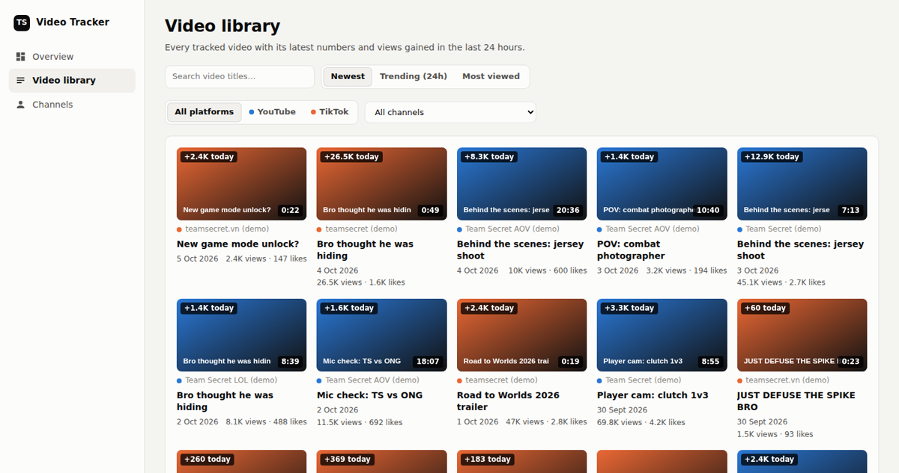

# TS Video Tracker

Live YouTube and TikTok performance for the Team Secret creative team: one place to see
followers, views gained, engagements and top videos across every Team Secret channel,
in the spirit of Sprout Social but refreshed every few minutes.





## What it does

- **Overview**: total followers, views gained, engagements and videos published, each
  compared with the previous period; hourly or daily trend charts per platform; a
  channel performance table; top videos ranked by views gained.
- **Video library**: every tracked video as a thumbnail grid, searchable, sortable by
  newest, trending (views gained in 24 h) or most viewed.
- **Channels**: add YouTube channels by @handle, ID or URL; connect TikTok accounts
  with one sign-in; see sync status and errors per channel.
- **Filters** for date range (24 h, 7, 30, 90 days), platform and channel scope every
  number on the page. **Export CSV** downloads the current view.
- Data refreshes in the browser every 60 seconds; the server collects new numbers on a
  schedule (every 10 minutes by default) or when someone clicks **Sync now**.
- Google sign-in, limited to an allow-list of emails or company domains.

## How fresh is "live"?

| Source | What we get | Freshness |
| --- | --- | --- |
| YouTube Data API v3 | Views, likes, comments per video; subscribers, total views per channel | Every poll (10 min). YouTube itself updates public counters every few minutes. Subscriber counts are **rounded by YouTube** to 3 significant figures, so subscriber growth moves in steps. |
| TikTok Display API | Followers, likes per account; views, likes, comments, shares per video | Every poll. Covers the 50 most recent videos per account (same for YouTube). |

Not available from these public APIs (same limits Sprout has): watch time, retention,
traffic sources and revenue. Those need the YouTube Analytics API and are reported with a
1-2 day delay (see Roadmap).

**YouTube quota:** 10,000 units/day by default. One poll costs about 2 units per
channel, so 10 channels every 10 minutes uses about 3,000 units/day. "Sync now" is
rate-limited to once every 2 minutes.

## Setup

### 1. Database
Create a Postgres database (Neon, Supabase, Vercel Postgres...) and set `DATABASE_URL`.
Tables are created automatically on first start.

### 2. Google sign-in
1. Google Cloud Console → APIs & Services → Credentials → **Create OAuth client ID**
   (Web application).
2. Authorised redirect URI: `https://<your-domain>/api/auth/callback/google`.
3. Set `AUTH_GOOGLE_ID`, `AUTH_GOOGLE_SECRET`, `AUTH_SECRET` (`openssl rand -base64 32`).
4. Set who can sign in: `ALLOWED_EMAILS` and/or `ALLOWED_EMAIL_DOMAINS`. With both
   empty, nobody can sign in.

### 3. YouTube
In the same Google Cloud project, enable **YouTube Data API v3** and create an
**API key** (restrict it to that API). Set `YOUTUBE_API_KEY`.

### 4. TikTok
1. Create an app at [developers.tiktok.com](https://developers.tiktok.com) with
   **Login Kit** and **Display API**, scopes `user.info.basic`, `user.info.stats`,
   `video.list`.
2. Redirect URI: `https://<your-domain>/api/tiktok/callback`.
3. Set `TIKTOK_CLIENT_KEY`, `TIKTOK_CLIENT_SECRET`, `TIKTOK_REDIRECT_URI` and
   `TOKEN_ENCRYPTION_KEY` (`openssl rand -base64 32`; tokens are stored AES-GCM encrypted).
4. Submit the app for review. Until it is approved, add the Team Secret TikTok accounts
   as sandbox target users so they can connect for testing.
5. In the app, open **Channels → Connect with TikTok** and sign in as each account.

### 5. Deploy and schedule
Deploy to Vercel (or any Node host) with the variables from `.env.example`, then pick one
scheduler that calls `GET /api/cron/poll` with `Authorization: Bearer <CRON_SECRET>`:

- **GitHub Actions** (included): `.github/workflows/poll.yml` runs every 10 minutes.
  Add repository secrets `APP_URL` and `CRON_SECRET`.
- **Vercel Cron** (Pro plan for sub-daily schedules) or **cron-job.org**.
- A server crontab running `npm run poll`.

## Local preview

```bash
npm install
npm run db:seed-demo          # fake, clearly-labelled "(demo)" data in .data/
AUTH_DISABLED=true AUTH_SECRET=dev npm run dev
```

Open http://localhost:3000. `AUTH_DISABLED` only works outside production.

## Scripts

| Command | Purpose |
| --- | --- |
| `npm run dev` / `build` / `start` | Next.js |
| `npm test` | Unit tests (embedded Postgres, mocked YouTube/TikTok) |
| `npm run lint` | Type-check |
| `npm run poll` | Run one sync from the command line |
| `npm run db:generate` | Create a migration after editing `src/db/schema.ts` |
| `npm run db:seed-demo` | Demo data for local preview (refuses to run with `DATABASE_URL`) |

## How it works

- `src/lib/youtube.ts`, `src/lib/tiktok.ts`: API clients.
- `src/lib/poll.ts`: on each run, stores a snapshot of every account and its recent
  videos. Failures are recorded per channel and never stop the other channels.
- `src/lib/metrics.ts`: "gained" numbers are differences between snapshots, so the
  history starts when a channel is added. Videos published inside a period count from 0.
- `src/app`: Next.js App Router pages and JSON API routes; all API errors are JSON.

## Roadmap

- YouTube Analytics (channel owner sign-in): watch time, retention, traffic sources.
- Instagram / Facebook / X.
- Slack or Discord alerts when a video spikes.
- Downsample snapshots older than 30 days to hourly to keep the database small.
